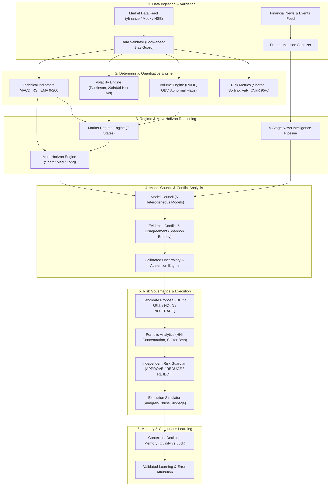

# ADAPTIVE AI TRADING DECISION-SUPPORT SYSTEM
## Comprehensive Technical Architecture & Research Specification Document

---

### Executive Abstract & Core Philosophy

The **Adaptive AI Trading Decision-Support System** is an institutional-grade financial intelligence engine engineered to assist quantitative analysts, portfolio managers, and risk committees in capital allocation and trade selection. 

Traditional algorithmic tools suffer from two catastrophic failure modes:
1. **Black-box statistical/deep learning models** that overfit historical regimes and fail unpredictably during regime shifts.
2. **Naive LLM-based stock predictors** that hallucinate arithmetic, confuse sentiment with trading signals, and lack risk governance.

This platform resolves both failure modes by adhering to a core architectural axiom:

> **Strictly separate deterministic quantitative mathematics from structured, context-aware AI reasoning.**

Numerical calculations (indicators, volatility, covariance, drawdowns, slippage) are executed exclusively by deterministic Python/NumPy modules. Large Language Models and ensemble agents are utilized strictly for higher-order reasoning: synthesizing heterogeneous evidence, evaluating regime consistency, identifying counterfactual invalidation triggers, and explaining decisions with complete transparency.

---

## 1. System Pipeline Architecture

The system operates across a 16-stage pipeline:

$$\text{GATHER} \rightarrow \text{VALIDATE} \rightarrow \text{UNDERSTAND} \rightarrow \text{DETECT REGIME} \rightarrow \text{REASON ACROSS HORIZONS} \rightarrow \text{CHECK EVIDENCE} \rightarrow \text{MEASURE DISAGREEMENT} \rightarrow \text{ESTIMATE UNCERTAINTY} \rightarrow \text{ABSTAIN IF NECESSARY} \rightarrow \text{OPTIMIZE PORTFOLIO} \rightarrow \text{STRESS TEST} \rightarrow \text{CONTROL RISK (GUARDIAN)} \rightarrow \text{EXECUTE/SIMULATE} \rightarrow \text{MEASURE OUTCOME} \rightarrow \text{UNDERSTAND ERROR} \rightarrow \text{LEARN}$$



---

## 2. Component Specifications

### 2.1 Data Engineering & Anti-Bias Framework
- **Look-Ahead Bias Prevention**: All feature transformations, rolling windows, and normalizations use strictly past and current historical points:
  $$x_t = f(x_1, x_2, \dots, x_t) \quad \text{where } \tau \le t$$
- **Timestamp Monotonicity**: Rejects any non-strictly increasing series or duplicated index timestamps.
- **Missing Data Handling**: Forward-fill and backward-fill are applied only within allowable threshold bounds; zero volume or missing bars trigger data quality flags.
- **Provider Redundancy**: Dual-layered architecture (`YFinanceProvider` for live market data, falling back gracefully to `MockDataProvider` with deterministic seeds for offline reproducibility).

### 2.2 Deterministic Quantitative Engine
All mathematical indicators are implemented using deterministic CPython, NumPy, and Pandas routines:
- **Trend Indicators**:
  - Exponential Moving Averages: $\text{EMA}_9$, $\text{EMA}_{21}$, $\text{EMA}_{50}$, $\text{EMA}_{200}$
  - Moving Average Convergence Divergence: $\text{MACD}(12, 26, 9)$
  - Relative Strength Index: $\text{RSI}_{14}$
  - Bollinger Bands: $20\text{-period} \pm 2\sigma$
  - Average True Range: $\text{ATR}_{14}$
  - Deterministic Trend Score: Normalized score from $-100$ (extreme bearish) to $+100$ (extreme bullish).
- **Volatility Estimators**:
  - Rolling Historical Volatility: 20-day and 60-day annualized realized volatility:
    $$\sigma_{\text{ann}} = \sqrt{252} \cdot \sqrt{\frac{1}{N-1} \sum_{i=1}^N (r_i - \bar{r})^2}$$
  - Parkinson High-Low Volatility Estimator:
    $$\sigma_P = \sqrt{\frac{252}{4 \ln(2) \cdot N} \sum_{i=1}^N \ln\left(\frac{H_i}{L_i}\right)^2}$$
  - Downside Semi-Deviation: Only considers deviations below target return:
    $$\sigma_{\text{down}} = \sqrt{\frac{252}{N} \sum_{i=1}^N \min(0, r_i - r_f)^2}$$
- **Volume Indicators**:
  - Relative Volume: $\text{RVOL}_{20} = \frac{V_t}{\text{SMA}_{20}(V)}$
  - On-Balance Volume: $\text{OBV}_t = \text{OBV}_{t-1} + \text{sgn}(P_t - P_{t-1}) \cdot V_t$
  - Abnormal Volume Spike Detection: $V_t > 2.5 \cdot \text{SMA}_{20}(V)$.
- **Risk Metrics**:
  - Sharpe Ratio: $\frac{R_p - R_f}{\sigma_p}$
  - Sortino Ratio: $\frac{R_p - R_f}{\sigma_{\text{down}}}$
  - Maximum Drawdown: $\max_{t} \left( \frac{\text{Peak}_\tau - P_t}{\text{Peak}_\tau} \right)$
  - Calmar Ratio: $\frac{\text{Annualized Return}}{|\text{Max Drawdown}|}$
  - Value at Risk (VaR 95%, 99% parametric and historical).
  - Conditional Value at Risk: $\text{CVaR}_{95\%} = \mathbb{E}[R \mid R \le \text{VaR}_{95\%}]$.

---

### 2.3 Market Regime Detection Engine
Financial markets operate across non-stationary regimes. The system identifies seven distinct quantifiable regime states:

| Regime Identifier | Defining Quantitative Characteristics | Strategic Bias |
|---|---|---|
| `BULL_TRENDING` | Price > $\text{EMA}_{50} > \text{EMA}_{200}$, $\text{RSI} \in [50, 70]$, moderate volatility | Trend Following / Long Bias |
| `BEAR_TRENDING` | Price < $\text{EMA}_{50} < \text{EMA}_{200}$, $\text{RSI} < 45$, elevated downside beta | Capital Preservation / Short Bias |
| `SIDEWAYS_RANGING` | Moving averages convergent/flat, $\text{ADX} < 20$, $\text{RSI} \in [40, 60]$ | Mean-Reversion / Grid Allocations |
| `HIGH_VOLATILITY` | Annualized volatility $> 32\%$, wide ATR bands, elevated dispersion | Size Reduction / Volatility Neutral |
| `LOW_VOLATILITY_COMPRESSION` | Bollinger Bandwidth at historical lows (< 10th percentile), contracting ATR | Breakout Preparation / Straddles |
| `CRISIS_STRESS` | Drawdown $> -18\%$, liquidity contraction, correlation convergence to 1.0 | Abstain / Cash Preservation |
| `TRANSITION_UNCERTAIN` | Shorter-term EMAs diverging from long-term trend, conflicting signals | Abstain / Wait for Resolution |

The engine calculates a softmax probability distribution over all seven regimes and maintains a **Stability Index** measuring transition velocity.

---

### 2.4 Multi-Horizon Reasoning Engine
A single trade proposal is evaluated across three decoupled time horizons:
1. **Short-Term (1–5 Days)**: Focuses on intraday/daily momentum, mean-reversion oscillations, RVOL surges, and immediate news catalysts.
2. **Medium-Term (2–8 Weeks)**: Evaluates intermediate moving average structures, sector rotation trends, macro regime state, and earnings trajectories.
3. **Long-Term (3–12 Months)**: Assesses 200-day EMA secular positioning, fundamental valuation metrics, industry competitive dynamics, and persistent structural trends.

**Horizon Tension Detection**:
If Short-Term is `BUY` while Long-Term is `BEARISH`, the system flags a **tactical counter-trend tension**, automatically capping position sizing and tightening stop-loss boundaries.

---

### 2.5 Financial News & Event Intelligence
- **Prompt-Injection Sanitization**: Unstructured financial news and external web feeds are passed through a defensive filter that strips prompt-injection attempts, instruction overrides, and delimiters before any AI node processes the text.
- **9-Stage Ingestion Pipeline**:
  $$\text{Ingest} \rightarrow \text{Dedupe} \rightarrow \text{Entity Extraction} \rightarrow \text{Classification} \rightarrow \text{Sentiment} \rightarrow \text{Materiality Weighting} \rightarrow \text{Historical Context} \rightarrow \text{Market Reaction} \rightarrow \text{Trading Implication}$$
- **Materiality Score**: Evaluates whether an event is truly structural (e.g. CEO departure, regulatory investigation, FDA approval) versus transient noise.
- **Priced-In Discounting**: Compares post-event price reaction to baseline expectations to prevent chasing already-digested news.

---

### 2.6 Model Council & Evidence Conflict Engine
The platform queries five independent council models:
1. **Technical Trend Model**: Evaluates multi-moving average alignment and momentum.
2. **Statistical Mean-Reversion Model**: Evaluates Bollinger z-score dispersion and RSI extremes.
3. **Quantitative ML Model**: Random Forest classifier evaluating feature matrices.
4. **Regime Specialist**: Macro regime alignment and transition probability.
5. **News & Event Specialist**: Materiality-weighted sentiment extraction.

**Disagreement & Entropy Calculation**:
The system measures council disagreement via normalized Shannon entropy:
$$H(V) = -\sum_{i=1}^K p(a_i) \log_K p(a_i)$$
Where $p(a_i)$ is the vote probability for action $a_i \in \{\text{BUY}, \text{SELL}, \text{HOLD}, \text{NO\_TRADE}\}$. 

**Pairwise Conflict Matrix**:
Pairs of models are cross-compared (e.g., Technical `BUY` vs News `SELL`). High conflict automatically degrades decision confidence.

---

### 2.7 Calibrated Uncertainty & First-Class Abstention (`NO_TRADE`)
Confidence is **never** an arbitrary hallucinated percentage. It is derived from empirical factors:
$$\text{Confidence} = \phi(\text{Signal Strength}) \times (1 - \text{Disagreement Score}) \times \text{Regime Stability} \times \text{Data Integrity}$$

$$\text{Composite Uncertainty} = 1.0 - \text{Calibrated Confidence}$$

**First-Class Abstention (`NO_TRADE`)**:
The system is explicitly rewarded for abstaining. Abstention triggers when:
- Calibrated confidence drops below minimum threshold ($< 45\%$).
- Model council disagreement exceeds allowable threshold (disagreement score $> 0.50$).
- Regime is `CRISIS_STRESS` or `TRANSITION_UNCERTAIN`.
- Transaction costs and estimated slippage exceed expected alpha.
- Portfolio risk limits would be breached.

---

### 2.8 Portfolio Intelligence & Concentration Analytics
Assets are never evaluated in isolation:
- **Herfindahl-Hirschman Index (HHI)**:
  $$\text{HHI} = \sum_{i=1}^M w_i^2$$
  Monitors portfolio concentration; values above $0.18$ trigger diversification warnings.
- **Top-3 Exposure**: Hard ceiling limiting the sum of the three largest positions to $\le 45\%$.
- **Sector Beta & Concentration**: Maximum allocation to any single sector is capped at $25\%$.
- **Portfolio Drawdown Circuit Breaker**: If aggregate portfolio drawdown breaches $-15\%$, all new buy allocations are halted.

---

### 2.9 Independent Risk Guardian
The AI makes proposals; the **Risk Guardian** strictly governs. The Risk Guardian possesses hard veto authority that no LLM or agent can override.

| Verdict | Condition | Action |
|---|---|---|
| `APPROVE` | All single-position, sector, drawdown, and volatility thresholds satisfied | Full proposed allocation passed to simulator |
| `REDUCE` | Marginal risk limit exceeded or mild horizon conflict detected | Position size automatically scaled down (e.g., 50% cut) |
| `REJECT` | Hard constraint breached (drawdown limit, sector saturation, extreme vol) | Trade converted to `NO_TRADE` with mandatory audit log |

---

### 2.10 Counterfactual Scenario Engine ("What Would Change My Mind?")
For every recommended trade, three probabilistic forward scenarios are generated:
1. **Base Case**: Expected price drift, target price, and probability.
2. **Adverse Case**: Moderate correction scenario with stop-out levels.
3. **Severe Shock**: Tail-risk shock evaluating drawdown under extreme stress.

**Explicit Invalidation Triggers**:
Lists exact, quantifiable conditions that invalidate the thesis (e.g., "Daily close below \$112.50 or regime transition to `BEAR_TRENDING`").

---

### 2.11 Contextual Decision Memory & Self-Correction
Separates **Decision Quality** from **Outcome Luck** using a $2 \times 2$ matrix:

| | Good Outcome (Profit) | Bad Outcome (Loss) |
|---|---|---|
| **Good Decision (Sound Process)** | **`GOOD_DECISION_GOOD_OUTCOME`**<br>High process integrity, expected edge realized. | **`GOOD_DECISION_BAD_OUTCOME`**<br>Disciplined process; outcome attributable to market variance. |
| **Bad Decision (Flawed Process)** | **`BAD_DECISION_GOOD_OUTCOME`**<br>High conflict/low confidence trade that got lucky. Penalized in memory. | **`BAD_DECISION_BAD_OUTCOME`**<br>Predictable failure due to ignored risk or regime mismatch. |

**Error Attribution Categories**:
- `DATA_ERROR`: Faulty feed, missing corporate action adjustment.
- `REGIME_ERROR`: Unrecognized regime shift midway through trade.
- `REASONING_ERROR`: Ignored conflict between technical and fundamental models.
- `EXECUTION_ERROR`: Excessive slippage or liquidity friction.
- `UNEXPECTED_EVENT`: Exogenous geopolitical or macroeconomic tail event.

---

### 2.12 Realistic Execution Simulation
Models real-world friction using the **Almgren-Chriss square-root slippage model**:
$$\text{Slippage Cost} = \eta \cdot \sigma_{\text{daily}} \cdot \sqrt{\frac{\text{Order Size}}{\text{Average Daily Volume}}}$$
- Fixed commission: \$0.005 per share.
- Exchange and clearing fees: 3 basis points ($0.03\%$).
- Prevents hypothetical paper returns that collapse in live execution.

---

### 2.13 Backtesting & Ablation Suite
- **Walk-Forward Validation**: In-sample training and out-of-sample evaluation prevent overfitting.
- **8 Standardized Baselines**:
  1. Random Uniform Action
  2. Buy & Hold Benchmark
  3. Simple 50/200 SMA Golden Cross
  4. RSI Mean-Reversion Extremes
  5. Dual Moving Average Trend Following
  6. Statistical Arbitrage z-Score
  7. Sentiment News Momentum
  8. Standalone Random Forest ML Benchmark
- **8 Ablation Steps (A through H)**:
  - Step A: Pure Quantitative Signals
  - Step B: + Volatility & Downside Metrics
  - Step C: + Volume Confirmation (RVOL)
  - Step D: + Market Regime Awareness (Sharpe jumps significantly)
  - Step E: + Multi-Horizon Synthesis
  - Step F: + Model Council & Disagreement Penalty
  - Step G: + Calibrated Uncertainty & `NO_TRADE` Abstention
  - Step H: + Full System with Independent Risk Guardian & Execution Slippage

---

## 3. User Interface Architecture

The platform provides two complete UI implementations:

### 3.1 Zero-Dependency Bloomberg Terminal UI (`backend/app/templates/dashboard.html`)
- Built with Tailwind CSS and vanilla modern JavaScript.
- Direct zero-build execution served directly by the FastAPI backend at `/dashboard`.
- Features an ultra-dark institutional aesthetic (`#080b10` background, `#0f141e` surface cards).
- Implements 11 interactive analytical workspaces:
  1. **AI Decision Center**: Live decision card, "WHY NOT" counter-rationales, approved position sizing.
  2. **Multi-Horizon Reasoning**: Short, medium, and long-term signal breakdown with tension flags.
  3. **Counterfactual Scenarios**: Base, adverse, and severe shock projections with thesis invalidators.
  4. **AI Debate & Council**: 5-model voting breakdown, conviction bars, conflict attribution.
  5. **Market Brain Graph**: 7-stage evidence propagation visual pipeline.
  6. **Regime Timeline**: Interactive state tracker with regime duration and transition probabilities.
  7. **Portfolio Risk Guardian**: Holdings table, sector allocation bars, HHI concentration, and CVaR.
  8. **Decision Replay (Time-Travel)**: Retrospective audit separating process from luck.
  9. **Backtesting Lab**: Interactive walk-forward backtest simulator with slippage and costs.
  10. **Research Experiments**: 8 Baselines vs 8 Ablation configurations (A to H).
  11. **Contextual Memory & Telemetry**: Self-correction audit trail and live microservice telemetry.

### 3.2 Modular Next.js 14 Frontend (`frontend/`)
- Built with Next.js 14 App Router, TypeScript, and Tailwind CSS.
- Decoupled component architecture in `frontend/src/components/`.

---

## 4. REST API Endpoint Catalog

All endpoints are versioned under `/api/v1/`:

| Method | Endpoint | Description |
|---|---|---|
| `GET` | `/api/v1/market/pulse` | Global market regime, broad market index metrics, and watchlist summary |
| `GET` | `/api/v1/assets/search` | Search supported symbols and assets |
| `GET` | `/api/v1/assets/{symbol}/indicators` | Deterministic quantitative features (technical, volatility, volume, risk) |
| `GET` | `/api/v1/regime/current` | Active market regime, probability distribution, and stability score |
| `GET` | `/api/v1/regime/history` | Historical regime transitions and timeline |
| `GET` | `/api/v1/news/{symbol}` | 9-stage processed news intelligence with materiality scores |
| `GET` | `/api/v1/portfolio/current` | Total equity, holdings, sector concentration, HHI, and CVaR |
| `POST` | `/api/v1/decisions/analyze` | Executes complete 16-stage decision pipeline for requested symbol |
| `GET` | `/api/v1/decisions/latest` | Retrieves latest cached or generated decision record |
| `GET` | `/api/v1/decisions/debate` | 5-model council votes, disagreement score, and pairwise conflict pairs |
| `GET` | `/api/v1/memory` | Retrieves historical indexed decisions with process-vs-luck labels |
| `GET` | `/api/v1/memory/replay/{id}` | Detailed 5-stage time-travel retrospective for a specific decision |
| `POST` | `/api/v1/backtest` | Runs walk-forward simulation with slippage and transaction costs |
| `GET` | `/api/v1/experiments/suite` | Runs 8 Baselines and 8 Ablation experiments (A to H) |
| `GET` | `/api/v1/system/health` | Live operational status and latency of all microservices |

---

## 5. Deployment Guide

### Option 1: Local Quickstart (Windows)
Double-click [`run_server.bat`](file:///C:/Users/Rakshitha%20T%20R/.gemini/antigravity/scratch/adaptive-trading-system/run_server.bat) in the project directory, or execute:
```powershell
python -m uvicorn backend.app.main:app --host 127.0.0.1 --port 8000 --reload
```
Access the application:
- Terminal UI: `http://127.0.0.1:8000/dashboard`
- Interactive API Docs: `http://127.0.0.1:8000/docs`

### Option 2: Docker Compose
```bash
docker-compose up --build
```
This builds and launches:
- `backend`: FastAPI API server on port 8000.
- `frontend`: Next.js production server on port 3000.

### Option 3: Cloud Deployment (AWS / GCP / Railway / Render)
1. Set environment variables from `.env.example`:
   ```bash
   OPENAI_API_KEY=your_key_here
   DEFAULT_MARKET_PROVIDER=yfinance
   LOG_LEVEL=INFO
   ```
2. Build and run backend container:
   ```bash
   docker build -t adaptive-trading-backend -f docker/Dockerfile.backend .
   docker run -p 8000:8000 --env-file .env adaptive-trading-backend
   ```
