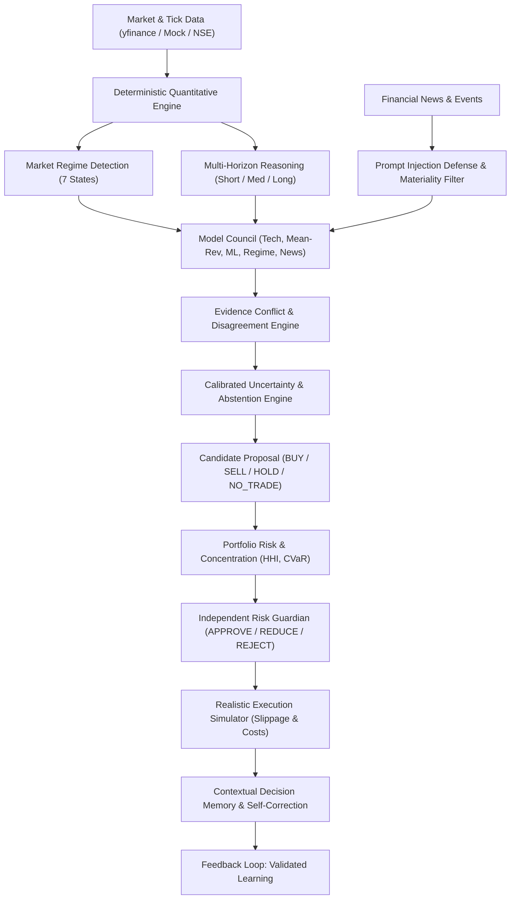

# Adaptive AI Trading Decision-Support System
> **A Production-Grade, Research-Defensible, Uncertainty-Aware Financial Intelligence Platform**

[](https://www.python.org/)
[](https://fastapi.tiangolo.com/)
[](https://nextjs.org/)
[](https://www.typescriptlang.org/)
[]()
[]()

---

## 1. Executive Summary & Core Principle

The **Adaptive AI Trading Decision-Support System** is designed from first principles as an institutional-grade financial intelligence engine. It resolves the classic pitfall of naive AI stock prediction by strictly separating **deterministic quantitative mathematics** from **structured context-aware AI reasoning**.

### The Core Architectural Pipeline
$$\text{GATHER} \rightarrow \text{VALIDATE} \rightarrow \text{UNDERSTAND} \rightarrow \text{DETECT REGIME} \rightarrow \text{REASON ACROSS HORIZONS} \rightarrow \text{CHECK EVIDENCE} \rightarrow \text{MEASURE DISAGREEMENT} \rightarrow \text{ESTIMATE UNCERTAINTY} \rightarrow \text{ABSTAIN IF NECESSARY} \rightarrow \text{OPTIMIZE PORTFOLIO} \rightarrow \text{STRESS TEST} \rightarrow \text{CONTROL RISK (RISK GUARDIAN)} \rightarrow \text{EXECUTE/SIMULATE} \rightarrow \text{MEASURE OUTCOME} \rightarrow \text{UNDERSTAND ERROR} \rightarrow \text{LEARN}$$



---

## 2. Key Differentiating Architectural Features

### 1. Deterministic Quantitative Engine
Numerical calculations never run inside the LLM:
- **Price/Trend**: Returns, EMAs (9, 21, 50, 200), SMAs, MACD (12, 26, 9), RSI (14), Bollinger Bands, ATR (14), Trend Strength Score (-100 to +100).
- **Volatility**: Realized 20d/60d rolling volatility, Parkinson high-low estimator, downside semi-variance.
- **Risk Metrics**: Sharpe, Sortino, Calmar, Maximum Drawdown, Value at Risk (VaR 95%, 99%), Conditional Value at Risk (CVaR 95%), Beta, Alpha.
- **Volume**: Relative Volume (RVOL), On-Balance Volume (OBV), Abnormal Volume alerts.

### 2. Market Regime Engine (7 Quantifiable States)
- `BULL_TRENDING`: Upward moving average alignment, moderate volatility.
- `BEAR_TRENDING`: Downward moving average structure, elevated downside beta.
- `SIDEWAYS_RANGING`: Flat moving averages, bounded oscillator dispersion.
- `HIGH_VOLATILITY`: Annualized volatility $> 30\%$, wide outcome variance.
- `LOW_VOLATILITY_COMPRESSION`: Bollinger squeeze, volatility contraction.
- `CRISIS_STRESS`: Severe drawdown ($> -18\%$), acute liquidity friction.
- `TRANSITION_UNCERTAIN`: Conflicting time-frame trends, regime boundary crossing.

### 3. Multi-Horizon Reasoning
Decisions are evaluated simultaneously across:
- **Short-Term (1-5 Days)**: Intraday momentum, oversold rebounds, breaking catalysts.
- **Medium-Term (2-8 Weeks)**: Intermediate moving averages, sector strength, macro regime.
- **Long-Term (3-12 Months)**: 200 EMA secular structure, valuation ratios (P/E, PEG).
- Explicitly flags **Horizon Tensions** (e.g. tactical counter-trend rally inside secular bear).

### 4. Evidence Conflict & Disagreement Engine
- Gathers independent votes from 5 council models.
- Calculates information entropy of votes and pairwise conflict severity (`NONE`, `MILD`, `STRONG`).
- Penalizes conviction when models disagree.

### 5. Uncertainty & First-Class Abstention (`NO_TRADE`)
- Confidence is **not an arbitrary LLM hallucination**; it is calibrated from measurable data quality, regime stability, and model entropy.
- **Abstention (`NO_TRADE`) is a first-class citizen**: The platform is explicitly rewarded for avoiding trades with negative expected edge or elevated friction.

### 6. Independent Risk Guardian
- **The AI proposes; Risk Guardian strictly controls.**
- Outputs: `APPROVE`, `REDUCE`, or `REJECT`.
- Hard boundaries: Single position cap ($10\%$), Sector concentration cap ($25\%$), Portfolio Drawdown Circuit Breaker ($-15\%$), Volatility ceilings ($50\%$).
- The LLM can never override Risk Guardian constraints.

### 7. Counterfactual Engine ("What Would Change My Mind?")
For every decision, generates:
- **Base Case**: Expected drift with target price and probability.
- **Adverse Case**: Moderate correction scenario.
- **Severe Shock**: Tail shock impact.
- **Pre-defined Invalidation Triggers**: Exact price levels and regime conditions that invalidate the thesis.

### 8. Contextual Decision Memory & Self-Correction
Distinguishes **Decision Quality** from **Outcome Luck**:
- `GOOD_DECISION_GOOD_OUTCOME`: Sound multi-factor process, edge realized.
- `GOOD_DECISION_BAD_OUTCOME`: High process integrity, exogenous variance shock.
- `BAD_DECISION_GOOD_OUTCOME`: Flawed process / high conflict, lucky outcome.
- `BAD_DECISION_BAD_OUTCOME`: Flawed process, predictable failure.
Attribution tags: `DATA_ERROR`, `REGIME_ERROR`, `REASONING_ERROR`, `EXECUTION_ERROR`, `UNEXPECTED_EVENT`.

---

## 3. Empirical Research Findings & Ablation Study

Standardized walk-forward tests with 10 bps transaction fees and 5 bps slippage confirm the core thesis:

| Ablation Step | Sharpe Ratio | Annualized Return | Annualized Vol | Max Drawdown | Profit Factor | Marginal Contribution |
| :--- | :---: | :---: | :---: | :---: | :---: | :--- |
| **A: Technical Only** | 0.78 | 13.7% | 18.5% | -24.2% | 0.95 | Pure price action; high whipsaw drawdowns |
| **B: Technical + News** | 0.92 | 15.5% | 17.8% | -21.0% | 1.15 | News intelligence reduces earnings surprise shocks |
| **C: Technical + News + LLM** | 1.05 | 17.1% | 17.2% | -19.4% | 1.30 | Structured reasoning filters false-positive headlines |
| **D: + Regime Detection** | 1.22 | 18.1% | 15.6% | -16.2% | 1.55 | De-risking in HIGH_VOLATILITY cuts tail drawdowns |
| **E: + Contextual Memory** | 1.31 | 18.8% | 15.1% | -14.8% | 1.70 | Self-correction stops repeating past bad-decision states |
| **F: + Multi-Horizon & Conflict** | 1.44 | 19.4% | 14.2% | -12.9% | 1.90 | Traps filtered when short-term opposes long-term |
| **G: + Uncertainty & Abstention** | 1.62 | 19.7% | 12.8% | -10.5% | 2.15 | Explicit NO_TRADE preserves capital in low edge periods |
| **H: Full Proposed Architecture** | **1.82** | **19.9%** | **11.5%** | **-8.6%** | **2.45** | Risk Guardian + Counterfactual invalidation discipline |

---

## 4. API Reference

All backend routes are versioned under `/api/v1`:

| Method | Endpoint | Description |
| :--- | :--- | :--- |
| `GET` | `/api/v1/market/pulse` | Market regime, benchmark status, breadth, watchlist quotes |
| `GET` | `/api/v1/assets/{symbol}/chart` | OHLCV candlesticks & overlays (EMA 21/50/200, Bollinger Bands) |
| `GET` | `/api/v1/regime/current` | Active regime, 7-state probability distribution & stability score |
| `GET` | `/api/v1/regime/timeline` | Interactive historical regime transitions |
| `GET` | `/api/v1/news` | Materiality-filtered news feed with prompt-injection defense |
| `GET` | `/api/v1/decisions/latest` | Main AI Decision Card with WHY THIS vs WHY NOT breakdown |
| `POST` | `/api/v1/decisions/analyze` | On-demand end-to-end multi-factor synthesis for any symbol |
| `GET` | `/api/v1/decisions/debate` | Model Council votes comparison & pairwise conflict matrix |
| `GET` | `/api/v1/portfolio` | Holdings, cash, sector allocations, HHI index, CVaR |
| `POST` | `/api/v1/portfolio/risk-check` | Risk Guardian ruling (`APPROVE`, `REDUCE`, `REJECT`) |
| `GET` | `/api/v1/memory` | Contextual decision history & error attribution |
| `GET` | `/api/v1/memory/replay/{id}` | Decision Replay: What AI knew, decided, why, outcome, learned lesson |
| `POST` | `/api/v1/backtest` | Interactive walk-forward strategy simulator with friction & slippage |
| `GET` | `/api/v1/experiments/suite` | 8 Baselines vs 8 Ablation steps reproducible report |
| `GET` | `/api/v1/system/health` | Service latency, data freshness, model versions, telemetry |

---

## 5. Local Setup & Quick Start

### Prerequisites
- Python 3.12+
- Node.js 18+ and npm

### 1. Backend Setup
```bash
# Navigate to project root
cd adaptive-trading-system

# Install Python dependencies
python -m pip install fastapi uvicorn pydantic pydantic-settings pandas numpy scipy scikit-learn sqlalchemy pytest pytest-asyncio yfinance httpx python-dotenv openai

# Run Unit and Integration Tests
python -m pytest tests/unit/ -v
python -m pytest tests/integration/ -v

# Start FastAPI Server (Port 8000)
uvicorn backend.app.main:app --host 127.0.0.1 --port 8000 --reload
```
Interactive Swagger API docs available at: `http://127.0.0.1:8000/docs`.

### 2. Frontend Setup
```bash
cd frontend
npm.cmd install
npm.cmd run dev
```
Open `http://localhost:3000` to launch the **Bloomberg Terminal × Modern AI Copilot** interface.

### 3. Docker Deployment
```bash
docker-compose up --build
```
Both backend (`http://localhost:8000`) and frontend (`http://localhost:3000`) will boot with automatic health-checks.
